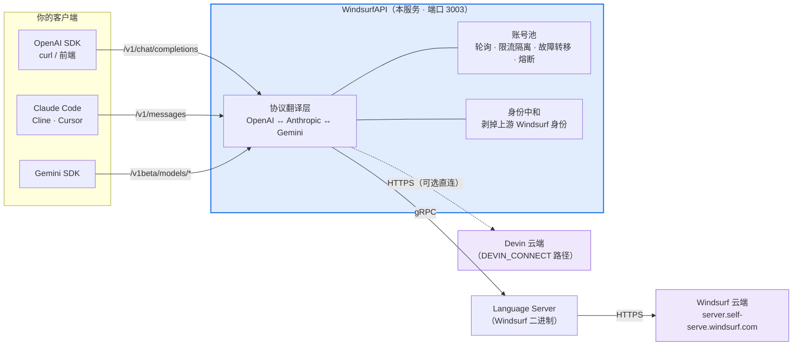
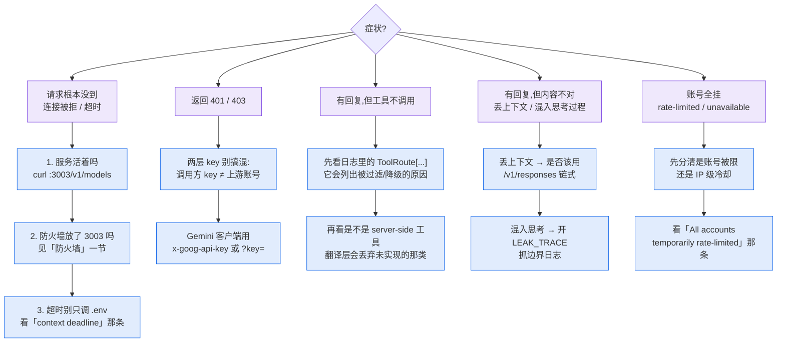

<p align="center">
  
</p>

# WindsurfAPI · DevinAPI

> 把 Windsurf / Devin 的 100+ AI 模型（Claude、GPT、Gemini、DeepSeek、Kimi、GLM、SWE…）变成 OpenAI Chat / Responses / Anthropic / Gemini 四套标准 API。零 npm 运行时依赖。

> **历史账本** · 把 1387 次提交、196 个版本、82 个 PR、180 个 issue 摊开给你看：时间线主账 + 贡献者分析 + Git 树三形态（竖/横/环）+ 自伤与返工全记录 —— [**打开可视化账本**](https://dwgx.github.io/WindsurfAPI/HISTORY-LEDGER-VIZ.html)（纯原生渲染，零依赖）


<p align="center">
  <a href="https://github.com/dwgx/WindsurfAPI/stargazers"></a>&nbsp;
  <a href="https://github.com/dwgx/WindsurfAPI/blob/master/LICENSE"></a>&nbsp;
  <a href="https://github.com/dwgx/WindsurfAPI/releases/latest"></a>&nbsp;
  <a href="https://github.com/dwgx/WindsurfAPI/actions/workflows/ci.yml"></a>&nbsp;
  <a href="https://dwgx.github.io/WindsurfAPI/"></a>&nbsp;
  <a href="https://github.com/dwgx"></a>
  &nbsp;·&nbsp;
  <a href="README.en.md">English</a>
</p>

# 声明

> **没点 Star 和 Follow 的**：严禁商业使用、转售、代部署、挂后台对外提供服务、包装成中转服务出售。
> **点了 Star 和 Follow 的**：随便用，我睁一只眼闭一只眼。
>
> 代码本体按 MIT License 开源（见 [LICENSE](LICENSE)），上面这段是作者个人态度。

---

把 [Windsurf](https://windsurf.com)（原 Codeium，现 Devin Desktop）的 AI 模型变成**四套标准 API 同时兼容**：

- `POST /v1/chat/completions` — **OpenAI 兼容** 任何 OpenAI SDK 直接用
- `POST /v1/completions` — **OpenAI 旧 Completions**（非流式；`prompt` 包成一条 user turn，流式请走 chat）
- `POST /v1/responses` — **OpenAI Responses 兼容**（另有 `GET` / `DELETE /v1/responses/{id}` 读取与删除已存响应，需带身份 header，见下）
- `POST /v1/messages` — **Anthropic 兼容** Claude Code / Cline / Cursor 直接连
- `POST /v1beta/models/*` — **Gemini 兼容** 直接对接 Gemini SDK

**100+ 模型**：Claude 4.5/4.6/Opus 4.7/5 · GPT-5/5.1/5.2/5.4/5.5/5.6-Luna 全系 · Gemini 2.5/3.0/3.1 · Grok · Qwen · Kimi K2.x · GLM 4.7/5/5.1/5.2 · MiniMax · SWE 1.5/1.6/1.7/2 · Arena 等。零 npm 依赖 纯 Node.js。

<sub>关键词：Windsurf 逆向 · Devin 代理 · Claude Code 中转 · Cursor 镜像 · AI 中转 API · OpenAI 兼容接口 · 免费 Claude/GPT/Gemini · 大模型反代 · Codeium 逆向</sub>

<p align="center">
  <a href="#它到底在干嘛">原理</a> ·
  <a href="#快速开始">5 分钟跑起来</a> ·
  <a href="#claude-code--cline--cursor-怎么用">客户端接入</a> ·
  <a href="docs/ENV-SWITCHES.md">环境开关</a> ·
  <a href="docs/">全部文档</a> ·
  <a href="README.en.md">English</a>
</p>

## 它到底在干嘛



<details>
<summary>纯文本版（不支持 mermaid 的环境）</summary>

```
     ┌─────────────┐   /v1/chat/completions   ┌────────────┐
     │ OpenAI SDK  │ ──────────────────────→  │            │
     │ curl / 前端 │ ←──────────────────────  │            │
     └─────────────┘   OpenAI JSON + SSE      │ WindsurfAPI│
                                              │ Node.js    │      ┌──────────────┐       ┌─────────────────┐
     ┌─────────────┐   /v1/messages           │ (本服务)   │ gRPC │ Language     │ HTTPS │ Windsurf 云端   │
     │ Claude Code │ ──────────────────────→  │            │ ───→ │ Server (LS)  │ ────→ │ server.self-    │
     │ Cline       │ ←──────────────────────  │            │ ←─── │ (Windsurf    │ ←─── │ serve.windsurf  │
     │ Cursor      │   Anthropic SSE          │            │      │  binary)     │       │ .com            │
     └─────────────┘                          └────────────┘      └──────────────┘       └─────────────────┘
                                                    ↑
                                                账号池轮询
                                                速率限制隔离
                                                故障转移
```

</details>

**它做了什么**：
1. 一个 HTTP 服务（端口 3003）同时暴露 OpenAI 和 Anthropic 两套 API
2. 把请求翻译成 Windsurf 内部 gRPC 协议，通过本地 Language Server 发给 Windsurf 云
3. 维护账号池，自动轮询 + 速率限制 + 故障转移
4. 返回前把上游 Windsurf 身份剥掉，模型自称"我是 Claude Opus 4.6 由 Anthropic 开发"

## Claude Code / Cline / Cursor 怎么用

模型本身**不会**操作文件 — 文件操作是 IDE Agent 客户端（Claude Code / Cline 等）在本地执行的：

```
 你 "帮我改 bug"                Claude Code                    WindsurfAPI               Windsurf Cloud
   │                                │                               │                          │
   │────────────────────────────→  │                               │                          │
   │                                │  POST /v1/messages            │                          │
   │                                │  messages + tools + system    │                          │
   │                                │ ─────────────────────────────→│ 打包成 Cascade 请求      │
   │                                │                               │ ──────────────────────→  │
   │                                │                               │                          │
   │                                │                               │               模型思考 → 返回
   │                                │                               │               tool_use(edit_file)
   │                                │                               │ ←──────────────────────  │
   │                                │ ←── Anthropic SSE ────────────│                          │
   │                                │   content_block=tool_use      │                          │
   │                                │                               │                          │
   │                                │ 本地执行 edit_file()          │                          │
   │                                │ (读写本地文件)                │                          │
   │                                │                               │                          │
   │                                │ 带 tool_result 再发一轮       │                          │
   │                                │ ─────────────────────────────→│ ──────────────────────→  │
   │                                │                                             ... (循环) ...
   │                                │                               │                          │
   │  ← 最终答案                    │                               │                          │
```

**重点**：WindsurfAPI 只负责**传递** tool_use / tool_result，真正改文件的是客户端 CLI。

## 快速开始

### 一键部署

```bash
git clone https://github.com/dwgx/WindsurfAPI.git
cd WindsurfAPI
bash setup.sh          # 建目录 · 配权限 · 生成 .env
node src/index.js
```

Dashboard：`http://你的IP:3003/dashboard`

### Docker 部署

```bash
cp .env.example .env
# 空 API_KEY / DASHBOARD_PASSWORD 是 fail-closed（compose 默认 0.0.0.0，起来也是 401）。
# compose 默认 DEVIN_CONNECT=1，不跑 Language Server，不会自动下载 LS。
# 只有关掉 DEVIN_CONNECT、走 Cascade 时才会在缺二进制时尝试安装 LS。

docker compose up -d --build
docker compose logs -f
```

默认挂载：

- `./.docker-data/data`：持久化 `accounts.json`、`proxy.json`、`stats.json`、`runtime-config.json`、`model-access.json`、`logs/`
- `./.docker-data/opt/windsurf`：Language Server 二进制与数据目录
- `./.docker-data/tmp/windsurf-workspace`：临时工作区

如果想改持久化目录，可在 `.env` 里设置 `DATA_DIR`。Docker 默认已设为 `/data`。

### 一键更新

部署过之后要拉最新修复，一条命令搞定：

```bash
cd ~/WindsurfAPI && bash update.sh
```

`update.sh` 做了：`git pull` → 通过 `install-ls.sh` 更新 LS binary → 停 PM2 → kill 3003 端口残留 → 重启 → 健康检查。

如果你用的是我们的公网实例（`skiapi.dev` 之类），不用管，我们已经推过了。

### 手动安装

```bash
git clone https://github.com/dwgx/WindsurfAPI.git
cd WindsurfAPI

# Language Server 二进制 —— 自动检测 Linux/macOS，一键下载 + chmod
bash install-ls.sh

# 下载链：WindsurfAPI release → 公开 LS mirror
#   https://github.com/dwgx/windsurf-ls-release/releases/latest/download
# → Exafunction/codeium fallback。需要私有镜像或回滚时可设置：
#   WINDSURFAPI_LS_RELEASE=https://github.com/<owner>/<repo>/releases/latest/download bash install-ls.sh

# 默认安装路径：
#   Linux x64:          /opt/windsurf/language_server_linux_x64
#   Linux arm64:        /opt/windsurf/language_server_linux_arm
#   macOS Apple Silicon: $HOME/.windsurf/language_server_macos_arm
#   macOS Intel:        $HOME/.windsurf/language_server_macos_x64

# 如果想用本地已下好的 binary：
#   bash install-ls.sh /path/to/language_server_linux_x64
# 或者指定 URL：
#   bash install-ls.sh --url https://example.com/language_server_linux_x64

# ⚠️ LS binary 版本偏旧 / 想换一个来源？
# 默认下载链已接入 dwgx/windsurf-ls-release 公开 mirror。
# 如果 mirror 暂未覆盖你的平台，仍可把 Windsurf 桌面端本体里的 LS binary 拷过来：
#
#   macOS:   "$HOME/Library/Application Support/Windsurf/resources/app/extensions/windsurf/bin/language_server_macos_arm"
#   Linux:   "$HOME/.windsurf/bin/language_server_linux_x64"
#            或  /opt/Windsurf/resources/app/extensions/windsurf/bin/language_server_linux_x64
#   Windows: %APPDATA%\Windsurf\bin\language_server_windows_x64.exe
#
#   # 从本地桌面端装：
#   bash install-ls.sh /path/to/language_server_linux_x64
#
# 注意：换 LS binary 不会改变 /v1/models 的内容。
# 模型目录是代理直连 HTTPS 拉的（GetCascadeModelConfigs / GetCliModelConfigs），
# 请求里的 ideVersion 写死在 src/windsurf-api.js，不从 binary 读 —— 所以目录只取决于
# 上游给这个账号授予了什么。看不到某个新模型，是上游还没放给该账号，不是本地文件旧了。

cat > .env << 'EOF'
PORT=3003
# Empty API_KEY is fail-closed (401) even on localhost.
# Local open access: WINDSURFAPI_ALLOW_UNAUTHENTICATED=1 and HOST=127.0.0.1
API_KEY=
DEFAULT_MODEL=claude-sonnet-4.6
MAX_TOKENS=8192
LOG_LEVEL=info
LS_BINARY_PATH=/opt/windsurf/language_server_linux_x64
LS_DATA_DIR=/opt/windsurf/data
LS_PORT=42100
# Empty DASHBOARD_PASSWORD is fail-closed. Local open panel: DASHBOARD_ALLOW_NO_AUTH=1
DASHBOARD_PASSWORD=
EOF

# macOS 本地部署时，使用 install-ls.sh 打印的 LS_BINARY_PATH，
# 并把 LS_DATA_DIR 设到用户可写目录，例如 /Users/you/.windsurf/data。

node src/index.js
```

## 加账号

服务跑起来之后要先加 Windsurf 账号才能用，三种方式：

**方式 1 Dashboard 一键登录（推荐）**

打开 `http://你的IP:3003/dashboard` → 登录取号 → 点 **Google 登录** 或 **GitHub 登录**（OAuth 弹窗）或直接填邮箱密码。所有方式都会自动入池。

**方式 2 Token（任何登录方式都能用）**

去 [windsurf.com/show-auth-token](https://windsurf.com/show-auth-token) 复制 Token：

```bash
curl -X POST http://localhost:3003/auth/login \
  -H "Content-Type: application/json" \
  -d '{"token": "你的token"}'
```

**方式 3 批量**

```bash
curl -X POST http://localhost:3003/auth/login \
  -H "Content-Type: application/json" \
  -d '{"accounts": [{"token": "t1"}, {"token": "t2"}]}'
```

## 调用示例

### OpenAI 格式（Python / JS / curl）

```python
from openai import OpenAI
client = OpenAI(base_url="http://你的IP:3003/v1", api_key="你设的API_KEY")
r = client.chat.completions.create(
    model="claude-sonnet-4.6",
    messages=[{"role": "user", "content": "你好"}]
)
print(r.choices[0].message.content)
```

### Anthropic 格式（Claude Code 直接连）

```bash
export ANTHROPIC_BASE_URL=http://你的IP:3003
export ANTHROPIC_API_KEY=你设的API_KEY
claude                # 正常用 Claude Code 即可
```

```bash
# 裸 curl 测试
curl http://localhost:3003/v1/messages \
  -H "Authorization: Bearer 你的key" \
  -H "anthropic-version: 2023-06-01" \
  -d '{"model":"claude-opus-4.6","max_tokens":100,"messages":[{"role":"user","content":"你好"}]}'
```

### Gemini 格式（Google GenAI SDK 直接连）

Gemini 原生客户端不发 `Authorization: Bearer`，它用 `x-goog-api-key` 头或 `?key=`
查询参数 —— 两种都收，所以官方 SDK 不用改代码就能连。

```python
from google import genai
client = genai.Client(
    api_key="你设的API_KEY",
    http_options={"base_url": "http://你的IP:3003"},
)
r = client.models.generate_content(model="claude-sonnet-4.6", contents="你好")
print(r.text)
```

```bash
# 非流式
curl "http://localhost:3003/v1beta/models/claude-sonnet-4.6:generateContent" \
  -H "x-goog-api-key: 你的key" \
  -H 'content-type: application/json' \
  -d '{"contents":[{"role":"user","parts":[{"text":"你好"}]}]}'

# 流式（?alt=sse 才是 SSE，不带就是 JSON 数组分片）
curl -N "http://localhost:3003/v1beta/models/claude-sonnet-4.6:streamGenerateContent?alt=sse" \
  -H "x-goog-api-key: 你的key" \
  -H 'content-type: application/json' \
  -d '{"contents":[{"role":"user","parts":[{"text":"数到三"}]}]}'
```

### OpenAI Responses 格式（带服务端会话状态）

`/v1/responses` 除了 POST，还有 `GET /v1/responses/{id}` 和 `DELETE /v1/responses/{id}`。
链式调用靠 `previous_response_id`，服务端替你保存上一轮 —— 这样第二轮不用重发历史。

```bash
# 第一轮：拿到 response id
curl http://localhost:3003/v1/responses \
  -H "Authorization: Bearer 你的key" \
  -H 'content-type: application/json' \
  -d '{"model":"claude-sonnet-4.6","input":"记住数字 42","store":true}'

# 第二轮：只发新问题，历史由服务端接上
curl http://localhost:3003/v1/responses \
  -H "Authorization: Bearer 你的key" \
  -H 'content-type: application/json' \
  -d '{"model":"claude-sonnet-4.6","input":"我让你记的数字是几?",
       "previous_response_id":"resp_把上一轮返回的id填这里","store":true}'

# 取回 / 删除
curl http://localhost:3003/v1/responses/resp_xxx -H "Authorization: Bearer 你的key"
curl -X DELETE http://localhost:3003/v1/responses/resp_xxx -H "Authorization: Bearer 你的key"
```

> 存储**默认开**（`RESPONSE_STORE_ENABLED=0` 关掉）。容量上限也可调：
> `RESPONSE_STORE_TTL_MS`（空闲超时,默认 1 小时）、`RESPONSE_STORE_MAX_AGE_MS`（绝对保留
> 上限,默认 24 小时）、`RESPONSE_STORE_MAX`（条数,默认 2000）、
> `RESPONSE_STORE_MAX_MESSAGES`（单会话消息数,默认 400）、`RESPONSE_STORE_MAX_BYTES`
> （总字节预算,默认 128m,支持 b/k/kb/m/mb/g/gb）。
>
> **租户隔离靠的是 response id 的 90 bit 熵,不是客户端自称的作用域** —— 共享同一个
> API key 时,两个调用方发相同的 `user` 会推导出逐字节相同的 callerKey,所以别把 id
> 当成除"难猜"以外的任何保证。

### Cline / Cursor / Aider

在客户端配置里 **Custom OpenAI Compatible**：
- Base URL: `http://你的IP:3003/v1`
- API Key: 你设的 API_KEY
- Model: 任选我们支持的模型

> **Cursor 用户注意**：Cursor 客户端白名单会拦截含 `claude` 的模型名（请求根本不到后端）。用以下别名绕过：
>
> | 在 Cursor 填 | 实际模型 |
> |---|---|
> | `opus-4.6` | claude-opus-4.6 |
> | `opus-4.6-thinking` | claude-opus-4.6-thinking |
> | `opus-4.7` | claude-opus-4-7-medium |
> | `sonnet-4.6` | claude-sonnet-4.6 |
> | `sonnet-4.5` | claude-4.5-sonnet |
> | `haiku-4.5` | claude-4.5-haiku |
> | `ws-opus` | claude-opus-4.6 |
> | `ws-sonnet` | claude-sonnet-4.6 |
>
> GPT / Gemini / DeepSeek 等不受 Cursor 白名单限制，直接填原名。

## 环境变量

| 变量 | 默认值 | 干嘛的 |
|---|---|---|
| `PORT` | `3003` | 服务端口 |
| `API_KEY` | 空 | 调 API 要带的密钥。空=默认 fail-closed（401，本机 bind 也一样）。本机开放需 `WINDSURFAPI_ALLOW_UNAUTHENTICATED=1` 且本机 bind |
| `WINDSURFAPI_ALLOW_UNAUTHENTICATED` | 关 | 空 `API_KEY` 时放行本机 bind。默认关。公网 bind 即使设了也不放行 |
| `DATA_DIR` | 项目根目录 | 持久化 JSON 状态和 `logs/` 的目录，Docker 推荐设成 `/data` |
| `DEFAULT_MODEL` | `claude-sonnet-4.6` | 不传 model 用哪个。必须是当前后端能解析的名字。Connect 上解析不到默认 400 `model_not_found`（`WINDSURFAPI_STRICT_MODEL=0` 才静默降级到免费 selector） |
| `MAX_TOKENS` | `8192` | 默认最大回复 token 数 |
| `LOG_LEVEL` | `info` | debug / info / warn / error |
| `WINDSURFAPI_LEAK_TRACE` | off | 推理/内容边界结构化日志(实验性,默认关闭)。开启后输出 `LEAK_TRACE` 前缀日志:原始流事件所属通道(content/reasoning)、think 标记、截断文本样本、settle 时 content/reasoning 字符数。用于在线抓取模型推理泄漏进 content 通道的问题。字段:channel/blockType/think/sample/len/reqId/account/msgId/contentChars/reasoningChars/rerouted |
| `WINDSURFAPI_IGNORE_CLOUD_FILTER` | `0` | Cascade 路径下，各账号云端 catalog 同步后，账号池列表展示活跃账号目录的并集，路由则校验所选账号自己的目录；设为 `1` 恢复完整静态 catalog。目录缺失、为空或同步失败时保持 fail-open；`DEVIN_CONNECT` 使用独立 selector catalog |
| `LS_BINARY_PATH` | `/opt/windsurf/language_server_linux_x64` | LS 二进制位置 |
| `LS_DATA_DIR` | Linux: `/opt/windsurf/data`；macOS: `~/.windsurf/data` | 每个 proxy 独立的 LS 数据根目录 |
| `LS_PORT` | `42100` | LS gRPC 端口 |
| `LS_MAX_INSTANCES` | 内存自适应，最多 `20` | LS 池最大实例数；2GB VPS 建议 `2` |
| `LS_POOL_WAIT_MS` | `30000` | LS 池满且全部 active 时，新 proxy LS 最多等待这么久再返回 `LS_POOL_EXHAUSTED` |
| `LS_SPAWN_MIN_AVAILABLE_BYTES` | `700MB` | 新增非 default LS 前要求的可用内存水位；低于该值会排队/拒绝，避免 OOM |
| `LS_MEMORY_GUARD` | `1` | 设 `0` 可关闭 LS 内存护栏（仅在你有外部 memory limit/监控时考虑） |
| `LS_IDLE_TTL_MS` | `1200000` | 非 default LS 空闲超过该时间自动停止；`0` 关闭 |
| `LS_IDLE_SWEEP_MS` | 自动推导 | LS 空闲回收扫描间隔 |
| `LS_PREWARM_DEFAULT` | `1` | 设为 `0` 可跳过启动时 default LS 预热，低内存/全 proxy 池改为首个真实请求再懒启动 |
| `LS_PREWARM_PROXIES` | `0` | 设为 `1` 才在启动时预热所有 proxy LS；默认按需启动。后台 scheduled probe / 预测 prewarm 只复用空闲常驻 LS，不会为了探测新开/等待/驱逐 LS |
| `LS_PREWARM_ON_ACCOUNT_ADD` | `0` | 设为 `1` 才在 Dashboard/批量导入/OAuth 添加账号后立即预热对应 LS；默认避免批量录入打爆内存 |
| `WINDSURFAPI_NATIVE_TOOL_BRIDGE` | 空 | 仅用于 lab/远程执行灰度。`all_mapped` 仅在已 allowlist 的工具全部可映射时走 native bridge；`1` 为混合工具 partition 模式。不要把它当成本地 IDE 工具调用的通用修复 |
| `WINDSURFAPI_NATIVE_TOOL_BRIDGE_TOOLS` | `Bash/shell_command/run_command` 语义族 | native bridge 工具 allowlist。默认只包含成熟的 Bash/run_command 路径；Read/Grep/Glob 和 WebSearch/WebFetch 必须显式加入 allowlist，再配合模型/账号/API key gate 小流量实测，仍不是生产默认 |
| `WINDSURFAPI_NATIVE_TOOL_BRIDGE_MODELS` / `PROVIDERS` / `ROUTES` / `CALLERS` / `ACCOUNTS` / `API_KEYS` | 空 | native bridge 灰度门。为空表示不限；设置后必须匹配才启用。`ACCOUNTS` 可填账号 id/email，`API_KEYS` 匹配调用方 API key 但不会把明文 key 传进 chat 逻辑 |
| `WINDSURFAPI_NATIVE_TOOL_BRIDGE_OFF` | 空 | 设为 `1` 强制关闭 native tool bridge，优先级高于上面的开关 |
| `WINDSURFAPI_SPECIAL_AGENT_BACKEND` | 空 | 可选 lab-only special-agent 后端。设为 `devin-cli` 后，`swe-1.6` / `swe-1.6-fast` / `adaptive` / `arena-*` 不再走 direct Cascade，而是走 Devin CLI PoC；这不是普通 catalog 模型修复 |
| `DEVIN_CLI_PATH` | `devin` | Devin CLI 可执行文件路径；Docker/macOS 都需要自己安装或挂载，不是基础镜像硬依赖 |
| `DEVIN_CLI_MODE` | `print` | `print` 为 `devin -p` 保守模式；`acp` 为实验 ACP stdio 后端，使用账号池上游 Windsurf apiKey 认证，默认不全量启用 |
| `DEVIN_MAX_PROCS` | `1` | Devin CLI 最大并发进程数，避免 special-agent 路径把内存打爆 |
| `DEVIN_CLI_USE_ACCOUNT_POOL` | `1` | 默认从 WindsurfAPI 账号池取一个账号并把 apiKey 注入 `WINDSURF_API_KEY`；设 `0` 表示 Devin CLI 自己管理登录态 |
| `DASHBOARD_PASSWORD` | 空 | 后台密码。空=默认 fail-closed（本机 bind 也 401）。本机开放面板需 `DASHBOARD_ALLOW_NO_AUTH=1` |
| `ALLOW_PRIVATE_PROXY_HOSTS` | 空 | 设为 `1` 允许在代理测试和登录时使用内网 IP（如 `192.168.x.x`、`10.x.x.x`）。默认留空仅允许公网地址 |
| `CASCADE_REUSE_BY_CALLER` | `0` | 设为 `1` 启用 caller 级别回退复用。指纹未命中时，按 callerKey+model 回退到最近的 cascade。适合单用户 Claude Code 场景 |
| `CASCADE_POOL_MAX` | `500` | 对话池最大条目数。单用户场景设 `1`–`5` 即可，减少资源占用 |
| `CASCADE_REUSE_HASH_SYSTEM` | `1` | 默认把 system 打进复用指纹。设 `0` 退出（Claude Code 每轮改 cwd 时提高命中率，隔离变弱） |
| `STICKY_SESSION_ENABLED` | `0` | 设为 `1` 把同一会话固定在同一上游账号。DEVIN_CONNECT 上强烈建议开启：上游 prompt cache 按账号隔离且写入约为读取 5.6 倍单价（`devin-connect.js` 17.8%-of-miss 口径），不固定则每轮换号、整段上下文重写。需要 caller 有 per-user 信号（`user` / `safety_identifier` / `prompt_cache_key` / Claude Code `metadata.user_id`）；单用户自部署无这些信号时配 `WINDSURFAPI_SINGLE_TENANT_CACHE=1`。观测：`/dashboard/api/connect-metrics` 的 `sticky` 字段 |
| `STICKY_SESSION_TTL_MS` | `1800000` | 绑定 TTL（30 分钟）；活跃会话每轮自动续期 |
| `STICKY_SESSION_MAX` | `10000` | 绑定表上限，LRU 驱逐 |
| `RESPONSE_STORE_ENABLED` | `1` | Responses API 服务端会话状态。开启时 `previous_response_id` 可续接上下文(客户端只发新一轮);设 `0` 关闭后带该字段的请求返回 400,`GET`/`DELETE /v1/responses/{id}` 同样返回 400。按 callerKey 隔离:读取与删除与续接同一套作用域,别人的 id 一律 404(不泄漏是否存在)。**这句原本写"租户间不可互读",而那高估了保证的来源** —— 作用域本身**不是机密**:共享一个 API key 时 callerKey 是 `api:{hash(apiKey)}:user:{hash(body.user)}`,而 `user` 常是邮箱或账号 id,即可猜。真正挡住跨读的是 response id 的 **90 bit 熵**(`resp_` + UUIDv4 去横线取前 24 个 hex;96 bit 宽度减去落在切片内的 version/variant 固定位),实测作用域完全正确但 id 猜错一样 `not_found`。所以隔离在实践中成立,但它是"要撞对一个 90 bit 的 id",不是"作用域把租户分开了" —— 别把 `user` 当成访问控制用。**检索/删除没有请求体,身份信号走 header**:`GET /v1/responses/{id}` 带 `x-response-prompt-cache-key: <你 POST 时用的值>`。六种作用域信号都支持:`user` / `prompt_cache_key` / `safety_identifier` / `conversation` / `conversation_id` / `session_id`。**header 名把下划线换成连字符**(`x-response-conversation-id`);query 降级通道两种拼写都接受(`?conversation_id=` 与 `?conversation-id=`,其余多词信号同理)。取值必须与创建该响应时一致,否则 404。**只发一种信号并保持一致** —— 同时发多种不同的作用域信号时它们会被折叠成一个身份,所以多发一种就会改变派生出的 key(这是既有行为,不限于 query 通道)。**query 会被反代/CDN/浏览器历史记录,`user` 常含 PII,优先用 header** |
| `RESPONSE_STORE_TTL_MS` | `3600000` | **空闲**超时(1 小时),不是保留上界。比的是距上次访问的时间,而每次成功 `GET` 都会把它刷新 —— 所以单靠它,周期性读取可以让一个条目无限存活。绝对上界见下一行 |
| `RESPONSE_STORE_MAX_AGE_MS` | `86400000` | **绝对**保留上界(24 小时),从条目创建时刻算、不被读取刷新。默认取得远高于一次长 agent 会话而不是贴着空闲超时:把正在跑的循环的上下文中途丢掉,比多留一会儿更糟;总内存另有字节与条数两个上限管 |
| `RESPONSE_STORE_MAX` | `2000` | 最多保留多少个会话,LRU 驱逐 + 租户公平配额 |
| `RESPONSE_STORE_MAX_BYTES` | `128m` | 会话总字节预算(支持 b/k/kb/m/mb/g/gb)。条数上限约束的是数量不是内存 —— 实测真实 agent 会话每条约 167KB,2000 条约 327MB。按条数与字节两个维度中先触发的那个驱逐 |
| `DEVIN_CONNECT_IMAGE_TAG` | `10` | DEVIN_CONNECT 图片字段的 tag。默认使用真实 Devin schema 和 SWE-1.7 抓包共同验证的 repeated field `#10`；设 `0` 可回退为不发送图片，见下节 |
| `DEVIN_CONNECT_COLLAPSE_SYSTEM` | `0` | 设 `1` 后把 system 内容包成 `<system>...</system>`，按顺序并入下一条 user 消息，绕开上游对 field `#2` 更严格的内容策略。默认关闭；有 tools 且 field `#2` 为空时仍只保留既有 benign placeholder |
| `DEVIN_CONNECT_CATALOG_TTL_MS` | `300000` | DEVIN_CONNECT 在线模型目录的成功缓存 TTL（默认 5 分钟，最小 10 秒）。每个账号独立同步；失败或空响应保留最后一次成功目录 |

完整清单在 [.env.example](.env.example) —— 上表只列常用的。
只存在于源码里、两处都没收录的开关见 [docs/ENV-SWITCHES.md](docs/ENV-SWITCHES.md)。

## 图片 / 视觉怎么开

`DEVIN_CONNECT` 后端现在默认按真实 Devin wire 发送内联图片：

```sh
# 默认就是 10；仅在需要紧急回退时关闭
DEVIN_CONNECT_IMAGE_TAG=0
```

`10` 有两层独立证据：真实 Devin `.proto` 中 `ChatMessagePrompt.images` 是 repeated `#10`，
`ImageData` 是 `base64_data #1` / `mime_type #2`；真实 SWE-1.7 请求把图片直接挂在
`source=USER` 消息上，响应的 `modelUid` 仍是 `swe-1-7`，并正确识别了 macOS Dock、Sketch、
QQ 和 WPS。因此网关不再伪造 assistant `read` tool call、synthetic tool result 或顶层 `read`
ToolDef，也不再按 `swe-*` 名字硬判定“无视觉”。

普通 user 图片保持在原 user 消息上；多图按 repeated `#10` 写进同一条消息。原生 tool result
里的图片保持 `source=TOOL_RESULT`，同时保留调用方的 `tool_call_id #7`。目录同步还会解码
`ClientModelConfig.supports_images #5`，并在上游明确给出 true/false 时把 `supports_images`
暴露到 `/v1/models`；字段缺失时保持未知，不伪造 false。上游 `disabled #4` 的模型不会进入
实时目录。

`DEVIN_CONNECT_IMAGE_INNER_TAGS` 仍可覆盖内部 `base64,mime` tag（默认 `1,2`），仅用于未来
wire 变更的应急校准。远程 `https://` 图片 URL 仍不会由同步 wire builder 主动下载；请使用
data URL / base64，或显式开启 `DEVIN_ACP_VISION=1` 走本机 Devin CLI 的 ACP 视觉通道。

## Dashboard 功能面板

打开 `http://你的IP:3003/dashboard`：

| 面板 | 功能 |
|---|---|
| **总览** | 运行状态 · 账号池 · LS 健康 · 成功率 |
| **登录取号** | Google / GitHub OAuth 一键登录 · 邮箱密码登录 · **测试代理** 按钮（实测出口 IP） |
| **账号管理** | 加 / 删 / 停用 · 探测订阅等级 · 看余额 · 封禁模型黑名单 |
| **模型控制** | 全局模型黑白名单 |
| **代理配置** | 全局或单账号的 HTTP / SOCKS5 代理 |
| **日志** | 实时 SSE 串流 · 按级别筛 · 每条 `turns=N chars=M` 诊断多轮 |
| **统计分析** | 时间范围 6h / 24h / 72h · 账号维度 · p50 / p95 延迟 |
| **实验性** | Cascade 对话复用 · **模型身份注入（每厂商可自定义 prompt）** |

## 支持的模型

主线 100+ 个静态模型 + Windsurf 雲端動態下發（`mergeCloudModels` 啟動時拉取最新）。Cascade 路径下，各账号云端 catalog 同步后，`GET /v1/models` 和 Dashboard 展示活跃账号目录的并集，路由则校验所选账号自己的目录；`DEVIN_CONNECT` 继续使用独立 selector catalog；静态完整列表仍可查看 [GitHub Pages 模型清单](https://dwgx.github.io/WindsurfAPI/#models)（同步生成於 `src/models.js`）。

<details>
<summary><b>Claude（Anthropic）</b> — 36 个</summary>

claude-3.5-sonnet / 3.7-sonnet / thinking · claude-4-sonnet / opus / thinking · claude-4.1-opus · claude-4.5-haiku / sonnet / opus · claude-sonnet-4.6（含 1m / thinking / thinking-1m） · claude-opus-4.6 / thinking · **claude-opus-4.7-medium** · **claude-opus-4.8 全系**（low / medium / high / xhigh / max + fast） · **claude-5-fable / claude-sonnet-5 / claude-opus-5 全系**（low / medium / high / xhigh / max，opus-5 含 fast）

</details>

<details>
<summary><b>GPT（OpenAI）</b> — 65 个</summary>

gpt-4o · gpt-4.1 · gpt-5 全系（含 medium / high / codex） · **gpt-5.1 全系**（base / low / medium / high + fast + codex 全 6 變體） · **gpt-5.2 全系**（none / low / medium / high / xhigh + fast + codex 全 5 變體） · **gpt-5.4 全系**（base / mini × low/medium/high/xhigh） · **gpt-5.5 全系**（none / low / medium / high / xhigh + fast） · **gpt-5.6-luna 全系**（none / low / medium / high / xhigh） · o3 全系（base / mini / pro） · o4-mini

</details>

<details>
<summary><b>Gemini（Google）</b> — 9 个</summary>

gemini-2.5-pro / flash · gemini-3.0-pro / flash（minimal / low / medium / high 4 個 reasoning 等級） · gemini-3.1-pro（low / high）

</details>

<details>
<summary><b>开源 / 国产</b></summary>

**Kimi**: kimi-k2 / k2.5 / k2-6 / k2-7 · **GLM**: glm-4.7 / 5 / 5.1 / 5.2 · **Qwen**: qwen-3 · **Grok**: grok-3 / grok-3-mini-thinking / grok-code-fast-1 · **MiniMax**: minimax-m2.5

</details>

<details>
<summary><b>Windsurf 自家 + Arena</b></summary>

swe-1.5 / 1.5-fast / 1.6 / 1.6-fast / 1.7 / 1.7-lightning · arena-fast · arena-smart

</details>

> `swe-1.6` / `swe-1.6-fast` / `adaptive` / `arena-*` 属于 special-agent 路径。direct Cascade 会报 unknown model UID / route 不通；默认不会假装可用。需要测试时显式开启 `WINDSURFAPI_SPECIAL_AGENT_BACKEND=devin-cli`，并安装/挂载 Devin CLI。当前 PoC 是 `devin -p` print 模式，默认拒绝 caller-local tools/media；ACP 工具桥接另做。

> **免费账号 entitled 模型**主要是 `gemini-2.5-flash`、`glm-4.7`、`glm-5` / `5.1`、`kimi-k2` / `k2.5` / `k2-6`、`qwen-3` 等开源系列；Claude / GPT 全系 + Opus 系列要 Pro。具体每个账号的 entitled 清单看 dashboard。
>
> **工具调用稳定性**（v2.0.82+ 实测）：Claude family 走 `<tool_use>` 协议最稳；GLM-4.7 / Kimi-K2.5 走 NLU 兜底 + 可选 retry 大部分 case 能调；GLM-5.1 在 cascade 后端不稳（经常空回复 textLen=0），proxy 救不动；GPT 在 cascade 协议层不传 tools[] schema 也救不全。Claude Code 调本地工具优先 `claude-haiku-4.5` / `claude-sonnet-4.6`。

## 架构要点

- **零 npm 依赖** 全走 `node:*` 内置 · protobuf 手搓（`src/proto.js`）· 图片编解码 vendored（`src/vendor/`，BSD-3 jpeg-js + 自研纯-Node PNG 解码）· 下载即跑
- **账号池 + LS 池** 每个独立 proxy 一个 LS 实例 不混用
- **NO_TOOL 模式** `planner_mode=3` 关掉 Cascade 内置工具循环，避免 `/tmp/windsurf-workspace/` 路径泄漏
- **三层 sanitize** LS 内建工具结果过滤 · `<tool_call>` 文本解析 · 输出路径清洗
- **真实 token 计量** 从 `CortexStepMetadata.model_usage` 抓 Cascade 真实 `inputTokens` / `outputTokens` / `cacheRead` / `cacheWrite`，`prompt_tokens` 含 cacheWrite

## PM2 部署

```bash
npm install -g pm2
pm2 start src/index.js --name windsurf-api
pm2 save && pm2 startup
```

**不要**用 `pm2 restart`（会出僵尸进程），用一键更新脚本 `bash update.sh`。

## 防火墙

```bash
# Ubuntu
ufw allow 3003/tcp

# CentOS
firewall-cmd --add-port=3003/tcp --permanent && firewall-cmd --reload
```

云服务器记得去安全组开 3003。

## 出问题了先看这里

按**症状**找,不用通读下面的问答。这是协议转换网关,所以排查的第一步永远是
**分清是哪一层坏了** —— 客户端、本网关、还是上游。



**两条最容易踩的**：

| 现象 | 真实原因 |
|---|---|
| 改大 `.env` 里的 timeout 但 `context deadline exceeded` 还在 | 那个超时不在这一层。见下面同名问答 |
| 一开就"所有账号 rate-limited",怀疑代理坏了 | 大概率是 IP 级冷却,不是账号问题也不是代理问题 |

排查请求链路时,**发真实请求看响应,别只读代码** —— 这是协议转换网关,两层
key、四条出口路径,读代码容易推错。

## 常见问题

**Q: 登录报"邮箱或密码错误"**
A: 你是用 Google/GitHub 登录的 Windsurf 吧 那种账号没有密码。Dashboard 的登录取号面板现在直接支持 Google / GitHub OAuth 一键登录。

**Q: 模型说"我无法操作文件系统"**
A: 这是 **chat API**，不是 IDE agent。要让模型真的改文件，用 **Claude Code / Cline / Cursor / Aider** 之类的客户端 CLI，把它们的 API base URL 指向本服务就行。模型出 tool_use，客户端本地执行，再把 tool_result 发回来。上面的图有详细流程。

**Q: 上下文丢失 / 模型忘了前面说的**
A: 多账号轮询**不会**丢上下文 — 每次请求都重新打包完整 history 发给 Cascade。真正的原因通常是中转层（new-api 等）没把完整 `messages[]` 透传过来。在 Dashboard 日志面板看 `turns=N`：如果多轮对话但 `turns=1`，就是中转层在你之前就把历史丢了。

**Q: 长 prompt 超时**
A: 已修。cold stall 检测按输入长度自适应，长输入最多给 90s。

**Q: Claude Code 能用吗**
A: 能。`export ANTHROPIC_BASE_URL=http://你的API` + `export ANTHROPIC_API_KEY=你的key`。`/v1/messages` 支持 system + tools + tool_use + tool_result + stream + multi-turn 全套，已实测通过。

**Q: 免费账号能用什么模型**
A: 主要是 `gemini-2.5-flash`、`glm-4.7` / `5` / `5.1`、`kimi-k2` / `k2.5` / `k2-6`、`qwen-3` 这些开源系列。Claude family + GPT 全系 + Opus / Max / Thinking 高阶模型要 Pro entitlement。具体每个账号的 entitled 清单 dashboard 里看 — `model_not_entitled` 错误返回的 `available_in_pool` 字段也会列出账号池能用的。

**Q: 免费账号调工具稳吗**
A: 看模型。Claude family `<tool_use>` 协议训练扎实最稳（free 账号若 entitled 也是优选）；GLM-4.7 / Kimi-K2.5 走 NLU 兜底 + `WINDSURFAPI_NLU_RETRY=1` retry-with-correction 多数 case 能调；GLM-5.1 在 cascade 后端经常空回复 proxy 救不动；GPT 系列受 cascade 协议层限制（不传 OpenAI tools[] schema）也不稳。**Claude Code / Cline / Codex 调本地文件 / 跑命令优先 `claude-haiku-4.5` 或 `claude-sonnet-4.6`**。

**Q: 客户端显示“没有调用工具”，怎么排查**
A: 先看日志里的 `ToolRoute[...]`。它会列出客户端声明的工具、`tool_choice` 过滤后的有效工具、native bridge 映射/未映射工具、preamble 降级层级，以及 `tool_choice_none` / `forced_tool_not_declared` / `preamble_compacted` / `native_bridge_*` 等原因。`/v1/messages` 和 `/v1/responses` 的 server-side 工具（如 Anthropic advisor/code_execution，OpenAI file_search/mcp/computer_use）如果代理没有实现，会在翻译层丢弃；这类工具不是普通 function tool，不等于 WindsurfAPI 已经能替客户端执行。native bridge 也不是“本地 IDE 工具修复开关”：默认安全路径仍是 prompt/tool emulation，由客户端本地执行工具；native bridge 是让 Windsurf 远端 workspace 执行 Cascade 内置工具，只适合有模型/账号/API key gate 的小流量实验。

**Q: 31 个 trial 账号一会儿就全 unavailable**
A: 八成是用了周限模型 — `claude-opus-4-7-max` / `gpt-5.5-xhigh` / `claude-sonnet-4-7-thinking` 这类高 reasoning effort 变体每个账号每周只有 5 次配额，31 号 × 5 次 ≈ 150 次就到顶。换 `claude-sonnet-4.6` / `claude-haiku-4.5` daily 配额比较宽松。`docker logs windsurfapi-windsurf-api-1 | grep rate_limit` 看每个账号的 cooldown 字段验证。

**Q: All accounts temporarily rate-limited / IP-level cooldown 是不是代理坏了**
A: 通常不是。Windsurf 上游会对同一出口 IP + 同一模型的密集请求施加 cooldown，多个账号绑在同一出口时会一起被限流。WindsurfAPI 会停止继续烧账号并返回 `429 + Retry-After`；v2.0.140 起这个等待时间会按上游 `Resets in: 27m12s` 这类真实值返回，而不是固定提示 30 秒。解决方向是降并发、换更宽松模型、给账号绑定不同出口 IP，或者等上游 cooldown 到期。

**Q: free 账号是不是本地限制成 1 分钟 1 次**
A: 不是。本地 free tier RPM 默认是 10/min。你看到的 1/min 或一段时间后恢复，通常是 Windsurf 上游 free-tier 动态限频或模型 entitlement 限制。Dashboard 里看账号状态和模型可用清单；请求无权限模型时错误里的 `available_in_pool` 会列出当前账号池能用的模型。

**Q: context deadline exceeded / Client.Timeout 能靠调大 .env timeout 解决吗**
A: 不能。长 thinking / 长输出在约 236-243 秒断流，是 Windsurf provider/Cascade 单次 stream 窗口。WindsurfAPI 会把它标成 `upstream_deadline_exceeded` / `windsurf_provider_deadline`，并丢弃半截 Cascade 复用轨迹，避免下一轮上下文错乱。实际规避只能拆任务、降低 reasoning/max output，或换更快模型。

## 贡献者

特别感谢下面的朋友，他们提交过 PR 或系统性地审了代码，让这个项目变得更稳：

- [@dd373156](https://github.com/dd373156) — [PR #1](https://github.com/dwgx/WindsurfAPI/pull/1)
  修复 Pro 层级的模型合并逻辑：原本只看硬编码清单，云端动态拉回来的模型没进 tier 表，Pro 账号在 Cursor / Cherry Studio 里看不到新上线的模型。
- [@colin1112a](https://github.com/colin1112a) — [PR #13](https://github.com/dwgx/WindsurfAPI/pull/13)
  一次性审了 15 个安全 / 并发 / 资源管理 bug：XSS 转义、shell 注入、OOM 防护、auth 路由位置、gRPC 双回调、LS pool 竞态、HTTP/2 帧大小上限等。后续我们在这个基础上又加固了 JS-level `escJsAttr`、`_pending` 合并并发 `ensureLs`、LS 退出时释放 pooled session，并延伸修了 Antigravity 审计发现的 6 个问题。
- [@baily-zhang](https://github.com/baily-zhang) — [PR #36](https://github.com/dwgx/WindsurfAPI/pull/36) + [PR #45](https://github.com/dwgx/WindsurfAPI/pull/45)
  Cascade reuse 的核心修复：stableTurns 指纹匹配 (#36) 解决了 0% 命中率；trajectory offset 增量拉取 (#45) 消除了多轮复用时的上下文膨胀。
- [@aict666](https://github.com/aict666) — [PR #44](https://github.com/dwgx/WindsurfAPI/pull/44)
  修复 chat 调用后 inferTier 把 Pro/Trial 账号降级为 free 的 bug，保护了 GetUserStatus 设定的权威 tier。
- [@smeinecke](https://github.com/smeinecke) — [PR #43](https://github.com/dwgx/WindsurfAPI/pull/43)
  Dashboard 完整国际化：14 个 commit 覆盖中英文翻译、I18n 系统、check-i18n.js 校验工具。
- [@you922](https://github.com/you922) — [PR #162](https://github.com/dwgx/WindsurfAPI/pull/162) + [PR #163](https://github.com/dwgx/WindsurfAPI/pull/163)
  Sticky session 机制从零搭建（callerKey + modelKey → accountId 绑定）+ LS 崩溃指数退避自动重启。另外在 #164 提供了 SectionOverrideConfig 工具调用失效的源码级根因分析。
- [@Fermiz](https://github.com/Fermiz) — [PR #181](https://github.com/dwgx/WindsurfAPI/pull/181)
  Cascade 复用优化（单用户场景跳过轮询）+ HTTPS 代理层 + conversation-pool 大小可配置化。
- [@linqichenggg](https://github.com/linqichenggg) — [PR #175](https://github.com/dwgx/WindsurfAPI/pull/175)
  Windows / macOS / Linux 三平台 LS 路径统一：二进制路径、数据目录、安装脚本全部对齐。
- [@lauvww](https://github.com/lauvww) — [PR #182](https://github.com/dwgx/WindsurfAPI/pull/182)
  Dashboard 批量导入解析器重写：支持 JSON / CSV / 纯文本混合粘贴，自动检测分隔符。
- [@ucloudnb666](https://github.com/ucloudnb666) — [PR #184](https://github.com/dwgx/WindsurfAPI/pull/184)
  Astraflow 第三方提供商接入。
- [@datfooldive](https://github.com/datfooldive) — [PR #173](https://github.com/dwgx/WindsurfAPI/pull/173)
  Dashboard UI 大扫除：统一组件风格、优化卡片布局和响应式适配。
- [@The-five-stooges](https://github.com/The-five-stooges) — [PR #188](https://github.com/dwgx/WindsurfAPI/pull/188)
  Sticky session 流式路径修复 + body.user 多用户隔离机制 + stickyNoFallback / stickyBindByUserOnly 双开关。
- [@andya1lan](https://github.com/andya1lan) — [PR #192](https://github.com/dwgx/WindsurfAPI/pull/192)
  `update.sh` 通过 `install-ls.sh` 更新 LS binary，统一 WindsurfAPI release / 公开 LS mirror / Exafunction 下载链，并修复 macOS `grep -P` 兼容性。
- [@MatrixNeoKozak](https://github.com/MatrixNeoKozak) — [PR #195](https://github.com/dwgx/WindsurfAPI/pull/195)
  Dashboard API malformed JSON 现在返回 HTTP 400，不再用 200 包着 `ok:false`，让前端和自动化调用方能按状态码正确处理请求体格式错误。
- [@brandonedley](https://github.com/brandonedley) — [PR #201](https://github.com/dwgx/WindsurfAPI/pull/201)
  新增 GLM 5.2 和 Kimi K2.7 模型目录项，并同步 README / 英文 README / package 描述 / 模型 catalog 测试，给后续模型新增留下了代码、文档、测试一起更新的样板。
- [@forrinzhao](https://github.com/forrinzhao) — [PR #219](https://github.com/dwgx/WindsurfAPI/pull/219)
  定位到 codex `apply_patch` 工具描述里的 `FREEFORM tool, so do not wrap the patch in JSON.` 会触发 Devin content policy(飞书 codex bot 全量被拦),live-bisect 7/7 确定性复现,并做了关键的双片段 A/B —— 只改一处仍拦、两处都改才过。这个发现顺带暴露出更深的结构缺陷:工具描述 preamble 注入在 `neutralizeClientIdentity` **之后**,导致 native 路径上任何经由工具描述进来的触发词都绕过 a1-a6 整条防线。落地版把中和移到 preamble 注入之后,并把两条改写做成 `(a7)` 规则进既有序列(复用主开关与测试体系),因此覆盖所有客户端、所有触发词。另采纳其 `responses.js` 修复:Codex 发的 input item 是裸 `{role, content}` 不带 `type:'message'`,此前被静默丢弃导致上游收到空 messages → UPSTREAM_INTERNAL。
- [@warelik](https://github.com/warelik) — [PR #224](https://github.com/dwgx/WindsurfAPI/pull/224) [#225](https://github.com/dwgx/WindsurfAPI/pull/225) [#226](https://github.com/dwgx/WindsurfAPI/pull/226) [#227](https://github.com/dwgx/WindsurfAPI/pull/227) [#228](https://github.com/dwgx/WindsurfAPI/pull/228) [#229](https://github.com/dwgx/WindsurfAPI/pull/229)
  一轮六连,覆盖账号池、限流、身份中和、协议规范四个子系统。429 reset window 双链根因:上游给的 3h 重置窗口在传输层被丢(只解构 `{code, message}`),且 model-scoped 冷却对 `getApiKey(modelKey=null)` 的池选择结构上不可见 —— 两条只修一条都毫无效果,刚被 429 的账号几秒内被重选、一路撞到硬封(#224)。客户端断连不再当成账号故障:统一识别 abort(兼容 undici 与 AbortController 两种形态),流式/非流式全部退出路径不再罚 error budget、不再 failover 烧配额、不再往死 socket 写(#225)。Grok CLI 的 `You are Grok … released by xAI` self-ID 触发 content policy,补进 a1-a5 同族规则并整块剥离 `<executing_actions_with_care>`(#227)。thinking 块 `signature: ""` 改为省略,修严格客户端拒收(#228)。Responses usage 补齐 `input/output_tokens_details`,与 DEVIN_CONNECT 缓存 wire tag 校准正好凑成一条链的两半(#229)。另有 600 行零依赖的 pair-chain 会话连续性模块,从对话自身已完成的请求/响应对推导稳定 `session_id`,默认关、开关闭合时字节等价(#226)。
- [@warelik](https://github.com/warelik) — [PR #216](https://github.com/dwgx/WindsurfAPI/pull/216) + [PR #215](https://github.com/dwgx/WindsurfAPI/pull/215)
  中和上游 MCP-gate：server.codeium.com 对工具描述做指纹匹配，Cursor 21 个工具里 8 个被 permission_denied 拒掉；把 native #10 ToolDef 顶层描述换成工具名 + 递归剥参数 schema 的描述注解（保留结构和名叫 `description` 的参数），再把描述-only preamble 注入 system prompt 补回选工具上下文，21/21 全过（#216）。另修 Node 20+ IPv6 Happy Eyeballs 导致的 ETIMEDOUT：关掉 autoSelectFamily + 本地 HTTP/2 连接改用 127.0.0.1（#215）。

想加入这份名单？欢迎提 [issue](https://github.com/dwgx/WindsurfAPI/issues) 或 [pull request](https://github.com/dwgx/WindsurfAPI/pulls)。Dashboard 左侧的"致谢"面板是**更完整的一份**：它从 `contributors.json` 渲染,当前 27 位贡献者、53 条记录,每条还带分级与机制说明；上面这份名单是其中人工挑选的一部分。

## 授权

MIT License. See [LICENSE](LICENSE).

## 发布与密钥边界

发布流程会自动推 Docker 镜像和 GitHub Release。**别把 token、API key、cookie、上游账号凭据
写进 issue、PR、日志或提交的配置文件里。** 如果报告问题必须带上鉴权信息，只贴脱敏后的元数据
和复现步骤。

对应的英文段见 [README.en.md](README.en.md#release-and-secret-boundary)。

---

<p align="center">
  <a href="https://www.star-history.com/?type=date&repos=dwgx/WindsurfAPI">
    
  </a>
</p>

<p align="center">
  <a href="https://www.star-history.com/?type=date&repos=dwgx/WindsurfAPI">Star History · 点击查看完整星图</a>
</p>
